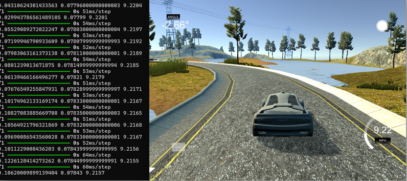

# Autonomous Vehicle Simulation 🚗




This project focuses on implementing the core functions of an autonomous vehicle—acceleration, braking, and steering control—within a simulation environment.By leveraging machine learning techniques, the vehicle is trained to navigate a predefined track safely and independently.

## 👥 Developers
* **Başar Sadettin Aksu** (me)
* [**İsmail Görkem Ulaş**](https://github.com/GorkemUlas)

---

## 🚀 Project Overview
The primary goal is to apply the fundamental principles of autonomous driving technology, where the vehicle perceives its environment and makes decisions without human intervention.
### Core Operating Principles:
**Computer Vision:** Perceives the environment and recognizes elements such as road boundaries.
**Path Planning:** Determines the optimal route to reach the target.
**Control:** Manages physical movements including acceleration, braking, and steering.

---

## 🛠️ Simulation Environment
The **Udacity Simulator** was chosen for this project.
**Why Udacity?** It offers a simpler setup, requires fewer hardware resources, and is ideal for implementing foundational concepts.
**Scope:** Environmental factors like pedestrians and traffic lights were excluded to focus on basic lane-keeping and driving.

---

## 📊 Data Collection & Preprocessing

### Data Collection
**Training Mode:** The vehicle is driven manually to record images from virtual onboard cameras along with driving parameters such as steering angle, speed, and throttle.
**Dataset Variety:** To create a robust dataset, the vehicle was driven for 3 laps in both forward and reverse directions on the same track.

### Preprocessing Pipeline
To optimize model performance, the data underwent several stages:
1. **Balancing:** To prevent the model from becoming biased toward straight driving, the number of "0-degree" steering samples was limited to a threshold of 350 using random sampling.
2. **Augmentation:** Techniques such as random zooming, panning, brightness adjustment, and horizontal flipping were applied to prevent overfitting and improve generalization.
3. **Image Processing:** Images were cropped to focus on the road (pixels 60-135), converted to the YUV color space for better lighting separation, and resized to $66 \times 200$ to match the NVIDIA architecture.

---

## 🧠 Model Architecture: NVIDIA CNN
The project utilizes the [**NVIDIA Convolutional Neural Network**](https://images.nvidia.com/content/tegra/automotive/images/2016/solutions/pdf/end-to-end-dl-using-px.pdf) architecture, which is optimized for end-to-end learning by mapping pixels directly to steering commands.

**Input:** $66 \times 200$ pixel normalized RGB images.
**Layers:** Consists of 5 convolutional layers for feature extraction and 3 fully connected layers for analysis.
**Training vs. Inference:** During training, data from three cameras (left, center, right) is used to help the model learn recovery.During autonomous driving, the model generates commands using only the center camera.

---

## 📈 Results & Future Work

### Current Results:
* The model successfully performs basic autonomous driving tasks in the simulator.
* Steering and speed control remain generally consistent.
* Dynamic throttle adjustment ensures safe speeds throughout the lap.

### Future Enhancements:
* Expanding the dataset with different weather conditions and road types.
* Integrating advanced features like object detection and lane tracking.
* Testing on physical RC vehicles and implementing sensor fusion (e.g., LiDAR/Radar).

---

### 🖥️ How to Run
To start the autonomous driving mode, use the following command:
```bash
python drive.py model.h5
